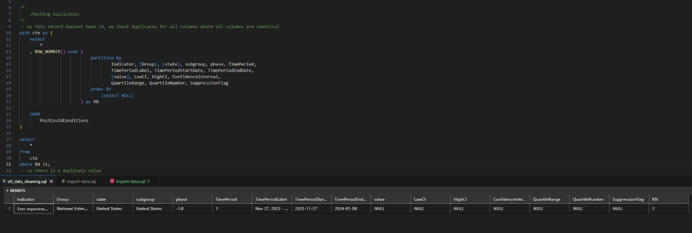

# Introduction
This is a ETL Data cleaning project on long covid dataset. To explore the knowledge of data analytics I am doing this project. As ETL plays vital role in data analytics. As MS Sql is popular in the industry. I am using MS Sql

# Analysing:
### 1. Finding Duplicates
This data has no id so we need to check all columns for finding duplicates. I used the window function to find and remove duplicates which is quick and handy to remove duplicates.

Output:

### 2. Removing Duplicates
As we know there is duplicates from the above step 1. We use window function to delete the duplicates.

Output:

### 3. Distinct Group
Dataset is lookgin so messy in the group and subgroup field so checking the distinct values of Group.

Total: 9 records

| Group |
|:------|
| By Sex
| By Disability status
| By Gender identity
| By Sexual orientation
| By State
| By Race/Hispanic ethnicity
| National Estimate
| By Education
| By Age

### 4. Distinct subgroup
Lets get it. 

Total: 78 records
| Subgroup |
| :--------| 
Illinois
Oklahoma
Non-Hispanic Asian, single race
Wisconsin
Bisexual
60 - 69 years
Maine
Pennsylvania
Massachusetts
Some college/Associate's degree
Ohio
Wyoming
Arizona
Oregon
Louisiana
50 - 59 years
Hawaii
New Hampshire
Non-Hispanic White, single race
40 - 49 years
Virginia
New York
South Dakota
Maryland
United States
High school diploma or GED
Bachelor's degree or higher
California
Missouri
Minnesota
District of Columbia
Florida
80 years and above
Without disability
Indiana
Transgender
Alaska
70 - 79 years
Gay or lesbian
Washington
Delaware
North Dakota
Connecticut
With disability
18 - 29 years
Male
New Jersey
Michigan
Iowa
Non-Hispanic Black, single race
North Carolina
Female
Vermont
Idaho
Less than a high school diploma
Georgia
Nebraska
Cis-gender female
Mississippi
Colorado
Texas
South Carolina
West Virginia
Non-Hispanic, other races and multiple races
Montana
Cis-gender male
Utah
Tennessee
30 - 39 years
Alabama
Rhode Island
Straight
Arkansas
Nevada
Kansas
Kentucky
Hispanic or Latino
New Mexico

### 5. Distinct Group after not including By State Demographic Factor:
As I decided to anlayse demographic of long covid  rates at the national level I am not inlcuding state demographic factor. 

Total: 8 records

| Group |
| :-----|
By Sex
By Disability status
By Gender identity
By Sexual orientation
By Race/Hispanic ethnicity
National Estimate
By Education
By Age

### 6. Distinct Subgroup after not including By state Demographic Factor:
Apart from my interest, now data looks good as well.

Total records: 27

| Subgroup |
| :--------|
Non-Hispanic Asian, single race
Bisexual
60 - 69 years
Some college/Associate's degree
50 - 59 years
Non-Hispanic White, single race
40 - 49 years
United States
High school diploma or GED
Bachelor's degree or higher
80 years and above
Without disability
Transgender
70 - 79 years
Gay or lesbian
With disability
18 - 29 years
Male
Non-Hispanic Black, single race
Female
Less than a high school diploma
Cis-gender female
Non-Hispanic, other races and multiple races
Cis-gender male
30 - 39 years
Straight
Hispanic or Latino